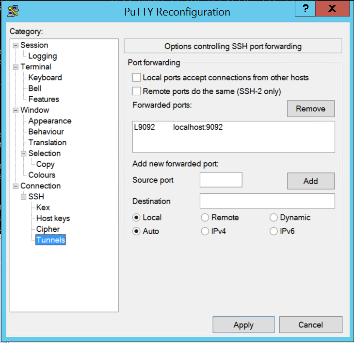

# How to remotely connect offset explorer/kcat/kacat etc to Kafka k8s/k3s deployment?

If Kafka is setup in k8s/k3s the quick option to make it reachable from other servers is to do port forwarding. For this approach you have to fist identify the listener configured for external connectivity and forward the identified internal port to a host port using port forwarding command given below.

All the below steps to be executed from the VM where Kafka is running.

> to export the Kafka pod name, replace the NAMESPACE and LABEL NAME, label name you can get when you list pods with additional switch _--show-labels_

`export POD_NAME=$(kubectl get pods --namespace <NAMESPACE> -l "<LABEL NAME>" -o jsonpath="{.items[0].metadata.name}")`

> port forwarding, replace HOST PORT with any free port in your host VM (e.g 9092), and replace CONTAINER PORT with the configured advertised external listener port (e.g 9092 for listner configured as localhost:9092) 

`kubectl --namespace <NAMESPACE> port-forward $POD_NAME <CONTAINER PORT>:<HOST PORT>`

Usually the external listener hostname/IP will be configured as localhost, which make it possible for all client running in the same server to connect to Kafka from outside the k8s network. But since this advertised listener is having localhost as hostname it will not be reachable from any other servers. Ideal option to explorer here is to change the Kafka listener configuration files and replace the localhost with the IP/FQN of the Kafka host VM. Another quick and dirty option discussed here is to use local port forwarding using a ssh tunnel to route the localhost traffic to a specific port in the client machine to a specific port (9092 in our case) in Kafka server machine. 

> to create a ssh tunnel in client VM

`ssh -L <LOCAL PORT>:<TARGET SERVER HOSTNAME MATCHING THE KAFKA ADV LISTNER>:<TARGET  PORT MATCHING KAFKA ADV LISTNER> <SSH USER TO THE TARGET SERVER>@<IP/HOSTNAME OF THE TARGET SERVER> -o ServerAliveInterval=60 -o ServerAliveCountMax=600`

Example below, we are forwarding local port 9092 to localhost 9092 in the target machine, for the ssh tunnel you are connecting as user 
sisadana and the IP of the target VM is 172.174.140.15. User will be prompted to authenticate.  

`ssh -L 9092:localhost:9092 sisadana@172.174.140.15 -o ServerAliveInterval=60 -o ServerAliveCountMax=600`

In windows machine user can use putty to configure this SSH tunnel.

reference: https://www.confluent.io/blog/kafka-listeners-explained/

**Note: Connection keep alive can be controlled by passing these additional attributes -o ServerAliveInterval=60 -o ServerAliveCountMax=600. Check for sshd configuration around connection keep alive if you are seeing stability issues even after adding these option.**
